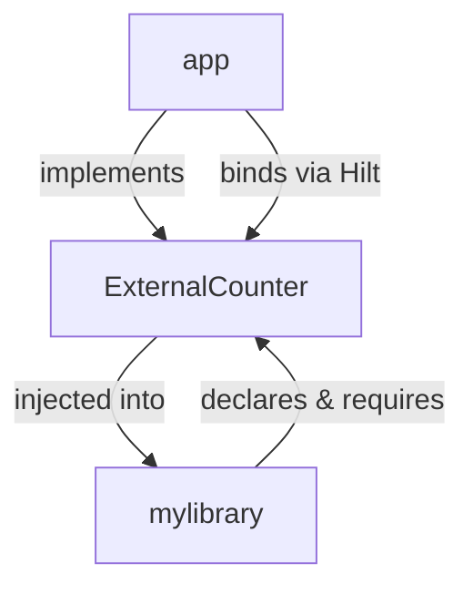

# mylibrary

An `android library` to play around with Hilt.

## ExternalCounter

* We are exposing the `examples/counter/ExternalCounter.kt` interface.
* `ExternalCounterViewModel` depends on `ExternalCounter`, someone needs to provide it to the Hilt graph.
  * In this example, we want `app` to implement `ExternalCounter` in `feature/external_counter/ExternalCounterImpl.kt` and provide it to Hilt on `feature/external_counter/di/ExternalCounterModule.kt`.
